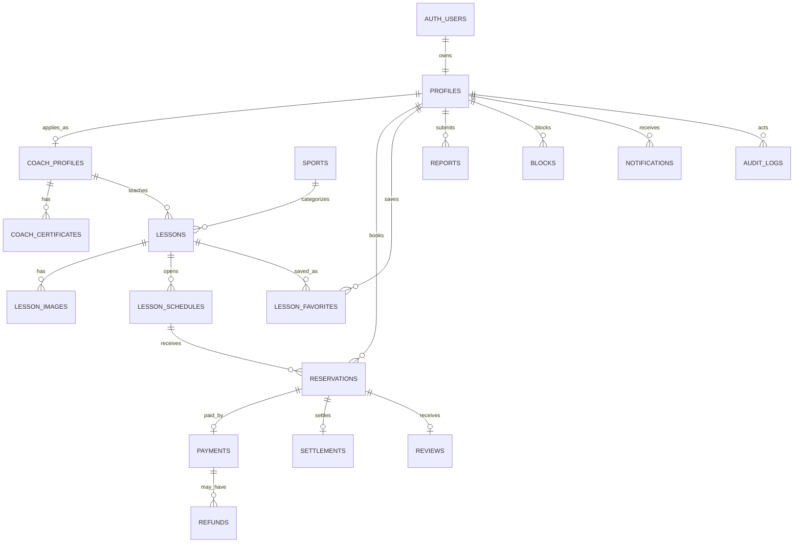

# SPOLINK ERD v0.1

## 문서 목적

SPOLINK MVP의 Supabase PostgreSQL 데이터 모델을 정의한다. 이 문서는 `SPOLINK_서비스_정책서.md`의 상태값과 운영 정책을 DB 구조로 옮기기 위한 기준 문서다.

## 설계 기준

- MVP는 `Supabase-first`로 구현한다.
- 인증 주체는 Supabase Auth의 `auth.users`다.
- 앱 사용자 데이터는 `public.profiles`에 분리 저장한다.
- 지도자 인증, 레슨, 예약, 결제, 환불, 정산, 리뷰, 신고를 MVP 핵심 도메인으로 둔다.
- 운동 메이트, 운동 기록, GPS/QR 출석, 배지, 목표 관리는 Phase 2 이후 테이블로 분리한다.
- 모든 주요 테이블은 `id`, `created_at`, `updated_at`을 가진다.
- 상태값은 enum 또는 check constraint로 제한한다.
- 파일 자체는 Supabase Storage에 저장하고 DB에는 경로와 메타데이터만 저장한다.
- 개인정보와 공개 프로필 정보는 분리한다.

## 핵심 엔티티

```text
auth.users
  └── profiles
        ├── coach_profiles
        │     ├── coach_certificates
        │     ├── lessons
        │     │     ├── lesson_schedules
        │     │     ├── reservations
        │     │     │     ├── payments
        │     │     │     ├── refunds
        │     │     │     ├── settlements
        │     │     │     └── reviews
        │     │     └── lesson_favorites
        │     └── settlements
        ├── reports
        ├── blocks
        └── audit_logs
```

## Enum / 상태값

### `user_status`

| 값 | 의미 |
|----|------|
| active | 정상 이용 가능 |
| pending_coach | 지도자 인증 심사 중 |
| coach_approved | 지도자 활동 가능 |
| suspended | 일시 제한 |
| deleted | 탈퇴 또는 삭제 처리 |

### `user_role`

| 값 | 의미 |
|----|------|
| learner | 학습자 |
| coach | 지도자 |
| admin | 관리자 |

### `coach_status`

| 값 | 의미 |
|----|------|
| draft | 제출 전 |
| submitted | 심사 요청 |
| approved | 승인 |
| rejected | 반려 |
| suspended | 승인 후 활동 제한 |

### `lesson_status`

| 값 | 의미 |
|----|------|
| draft | 작성 중 |
| pending_review | 관리자 검토 필요 |
| active | 예약 가능 |
| paused | 일시 중지 |
| closed | 예약 종료 |
| rejected | 관리자 반려 |

### `reservation_status`

| 값 | 의미 |
|----|------|
| pending_payment | 결제 전 임시 예약 |
| confirmed | 결제 완료 및 예약 확정 |
| cancelled_by_user | 학습자 취소 |
| cancelled_by_coach | 지도자 취소 |
| cancelled_by_admin | 관리자 취소 |
| completed | 수업 완료 |
| no_show_user | 학습자 노쇼 |
| no_show_coach | 지도자 노쇼 |
| disputed | 분쟁 접수 |

### `payment_status`

| 값 | 의미 |
|----|------|
| ready | 결제 요청 생성 |
| paid | 결제 승인 완료 |
| failed | 결제 실패 |
| cancelled | 결제 취소 |
| partially_refunded | 부분 환불 |
| refunded | 전액 환불 |

### `settlement_status`

| 값 | 의미 |
|----|------|
| pending | 정산 대기 |
| hold | 분쟁 또는 검토로 보류 |
| approved | 정산 승인 |
| paid | 지급 완료 |
| failed | 지급 실패 |

### `review_status`

| 값 | 의미 |
|----|------|
| visible | 노출 중 |
| hidden | 신고 또는 관리자 판단으로 숨김 |
| deleted | 삭제 |

### `report_status`

| 값 | 의미 |
|----|------|
| submitted | 신고 접수 |
| reviewing | 검토 중 |
| resolved | 조치 완료 |
| rejected | 신고 사유 부족 |

### action / target / notification enum

저장 상태 enum은 row의 결과만 나타내고 요청 body에는 사용하지 않는다. mutation은 다음 action
enum만 받아 현재 row를 잠근 workflow가 결과 상태를 파생한다.

| enum | 허용 값 |
|------|---------|
| lesson_status_action | submit, pause, resume, close, approve, reject |
| reservation_status_action | complete, mark_learner_no_show, mark_coach_no_show, open_dispute, cancel |
| report_status_action | start_review, resolve, reject |
| settlement_status_action | approve, hold |
| refund_result_action | complete, fail |
| report_target_type | user, coach, lesson, review, reservation |
| notification_type | coach_certification.submitted, coach_certification.reviewed, reservation_confirmed, reservation_cancelled, reservation.completed, reservation.no_show, review.requested, report.resolved, refund.result, settlement.status_changed |

`message`는 채팅이 구현되지 않은 MVP의 `report_target_type`에 포함하지 않는다. `paid`, `failed`
정산 상태는 향후 payout provider용으로 예약되어 있고 local MVP action enum으로는 도달할 수 없다.

## 테이블 상세

### `profiles`

Supabase Auth 사용자와 1:1로 연결되는 앱 사용자 프로필.

| 컬럼 | 타입 | 제약 | 설명 |
|------|------|------|------|
| id | uuid | PK, FK -> auth.users.id | 사용자 ID |
| role | user_role | not null, default learner | 기본 역할 |
| status | user_status | not null, default active | 계정 상태 |
| display_name | text | not null | 표시 이름 |
| real_name | text | nullable | 실명, 내부 검증용 |
| phone | text | nullable | 연락처 |
| avatar_path | text | nullable | Supabase Storage 경로 |
| default_region | text | nullable | 기본 활동 지역 |
| marketing_agreed_at | timestamptz | nullable | 마케팅 동의 |
| location_agreed_at | timestamptz | nullable | 위치정보 동의 |
| deleted_at | timestamptz | nullable | 탈퇴 처리 시각 |
| created_at | timestamptz | not null | 생성 시각 |
| updated_at | timestamptz | not null | 수정 시각 |

지도자 인증 상태 조합:

| `coach_profiles.status` | `profiles.role` | `profiles.status` |
|-------------------------|-----------------|-------------------|
| draft | learner | active |
| rejected | learner | active |
| submitted | learner | pending_coach |
| approved | learner | coach_approved |
| suspended | learner | suspended |

신청자 직접 insert/update로 상태, 제출/심사 시각, 심사자, 반려 사유를 바꿀 수 없다.
`upsert_coach_application_draft`, `submit_coach_application`, `review_coach_application` RPC가
각각 draft 저장, 제출, 관리자 심사의 원자적 쓰기 경계다.

인덱스:

- `profiles(role)`
- `profiles(status)`
- `profiles(default_region)`

### `coach_profiles`

지도자 인증과 공개 지도자 프로필.

| 컬럼 | 타입 | 제약 | 설명 |
|------|------|------|------|
| id | uuid | PK | 지도자 프로필 ID |
| user_id | uuid | unique, FK -> profiles.id | 사용자 |
| status | coach_status | not null, default draft | 인증 상태 |
| headline | text | nullable | 한 줄 소개 |
| bio | text | nullable | 소개 |
| primary_sport_id | uuid | FK -> sports.id | 대표 종목 |
| service_region | text | not null | 활동 지역 |
| career_years | integer | default 0 | 경력 연수 |
| intro_video_url | text | nullable | 소개 영상 |
| bank_name | text | nullable | 정산 은행 |
| bank_account_last4 | text | nullable | 계좌 끝 4자리 |
| payout_holder_name | text | nullable | 예금주 |
| submitted_at | timestamptz | nullable | 제출 시각 |
| reviewed_at | timestamptz | nullable | 심사 시각 |
| reviewed_by | uuid | FK -> profiles.id | 관리자 |
| rejection_reason | text | nullable | 반려 사유 |
| created_at | timestamptz | not null | 생성 시각 |
| updated_at | timestamptz | not null | 수정 시각 |

Storage 계약:

- bucket: `coach-certificates` private bucket (`public = false`)
- object name: `<user-id>/<server-generated-uuid>.(png|jpg|pdf)`; `file_path`에는 bucket 이름이나
  URL 없이 이 object name만 저장한다.
- 허용 형식: `image/png`, `image/jpeg`, `application/pdf`; 파일당 1 byte 이상 10MiB 이하
- signed upload/read TTL: 300초. 신청자는 자신의 draft/rejected 객체만 생성·삭제하며,
  관리자는 등록된 객체에 대한 signed read만 발급받는다.
- 소유자 prefix, MIME/확장자/magic bytes, 실제 Storage 객체와 메타데이터를 제출 전에 검증한다.
- 제출/승인 상태의 신청자 삭제 및 overwrite/upsert, 다른 사용자 prefix, public URL과 직접
  `storage.objects` 상태 변경은 거절한다.

인덱스:

- `coach_profiles(user_id)`
- `coach_profiles(status)`
- `coach_profiles(primary_sport_id)`
- `coach_profiles(service_region)`

### `coach_certificates`

지도자 자격증 파일과 검증 상태.

| 컬럼 | 타입 | 제약 | 설명 |
|------|------|------|------|
| id | uuid | PK | 자격증 ID |
| coach_profile_id | uuid | FK -> coach_profiles.id | 지도자 프로필 |
| certificate_name | text | not null | 자격증명 |
| issuer | text | nullable | 발급 기관 |
| certificate_number | text | nullable | 자격 번호 |
| file_path | text | not null | Storage 경로 |
| verified_at | timestamptz | nullable | 검증 시각 |
| rejected_reason | text | nullable | 반려 사유 |
| created_at | timestamptz | not null | 생성 시각 |
| updated_at | timestamptz | not null | 수정 시각 |

인덱스:

- `coach_certificates(coach_profile_id)`

### `sports`

종목 기준 테이블.

| 컬럼 | 타입 | 제약 | 설명 |
|------|------|------|------|
| id | uuid | PK | 종목 ID |
| name | text | unique, not null | 종목명 |
| slug | text | unique, not null | URL/검색용 키 |
| is_active | boolean | default true | 사용 여부 |
| created_at | timestamptz | not null | 생성 시각 |
| updated_at | timestamptz | not null | 수정 시각 |

초기 후보:

- 축구
- 야구
- 농구
- 테니스
- 배드민턴
- 러닝
- 헬스
- 필라테스
- 요가
- 수영

### `lessons`

지도자가 등록하는 레슨 상품.

| 컬럼 | 타입 | 제약 | 설명 |
|------|------|------|------|
| id | uuid | PK | 레슨 ID |
| coach_profile_id | uuid | FK -> coach_profiles.id | 지도자 |
| sport_id | uuid | FK -> sports.id | 종목 |
| status | lesson_status | not null, default draft | 레슨 상태 |
| title | text | not null | 제목 |
| summary | text | nullable | 짧은 설명 |
| description | text | not null | 상세 설명 |
| region | text | not null | 지역 |
| address | text | nullable | 상세 주소 |
| place_name | text | nullable | 장소명 |
| latitude | numeric | nullable | 위도 |
| longitude | numeric | nullable | 경도 |
| duration_minutes | integer | not null | 수업 시간 |
| price_amount | integer | not null | 가격, KRW |
| capacity | integer | not null, default 1 | 정원 |
| preparation | text | nullable | 준비물 |
| cancellation_policy_summary | text | nullable | 취소 요약 |
| paused_reason | text | nullable | 일시 중지 사유 |
| created_at | timestamptz | not null | 생성 시각 |
| updated_at | timestamptz | not null | 수정 시각 |

인덱스:

- `lessons(coach_profile_id)`
- `lessons(sport_id)`
- `lessons(status)`
- `lessons(region)`
- `lessons(price_amount)`
- `lessons(created_at desc)`

### `lesson_images`

검증을 통과해 앱 조회에 등록된 레슨 이미지. 객체는 public `lesson-images` Storage bucket에 있고,
DB 직접 mutation 대신 전용 RPC만 사용한다.

| 컬럼 | 타입 | 제약 | 설명 |
|------|------|------|------|
| id | uuid | PK | 이미지 ID |
| lesson_id | uuid | FK -> lessons.id | 레슨 |
| file_path | text | not null, unique | 서버 생성 `<lessonId>/<objectId>.(jpg\|png\|webp)` 경로 |
| sort_order | integer | 0..4 | 조밀한 노출 순서, 0은 표지 |
| lifecycle_state | text | ready 또는 deleting | 공개 준비/재시도 가능한 물리 삭제 영수증 |
| created_at | timestamptz | not null | 생성 시각 |

인덱스:

- `lesson_images(lesson_id, sort_order)`는 deferrable unique이며 레슨별 ready 순서를 `0..n-1`로 유지한다.
- 레슨당 `ready` 이미지와 유효한 `pending` intent 합계는 부모 레슨 잠금 아래 최대 5다.
  `deleting` 이미지가 있으면 새 intent/등록/검토 제출을 충돌로 막는다.
- `ready`만 공개/앱 조회에 포함한다. `deleting`은 Storage remove/finalize 재시도를 위한 영수증이다.

### `lesson_image_upload_intents`

signed upload 전에 생성하는 소유권·검증·정리 영수증.

| 컬럼 | 타입 | 제약 | 설명 |
|------|------|------|------|
| id | uuid | PK | intent ID |
| lesson_id | uuid | FK -> lessons.id | 잠글 부모 레슨 |
| coach_profile_id | uuid | FK -> coach_profiles.id | 서버가 인증 주체에서 파생한 소유자 |
| user_id | uuid | FK -> profiles.id | 서버가 `auth.uid()`에서 파생한 사용자 |
| object_name | text | unique, canonical | 서버 생성 immutable Storage object name |
| mime_type | text | jpeg/png/webp만 | 요청 MIME과 실제 객체 검증 기준 |
| size_bytes | bigint | 1..5,242,880 | 선언 크기 |
| status | text | pending/claimed/registered/cleaned/cancelled | 수명주기 |
| expires_at | timestamptz | not null | `statement_timestamp() + 2 hours` |
| claim_token | uuid | nullable | cleanup 소유권 token |
| claimed_at | timestamptz | nullable | bounded cleanup claim 시각 |
| registered_image_id | uuid | nullable | 등록 성공 이미지 |
| completed_at | timestamptz | nullable | 멱등 종료 시각 |
| created_at | timestamptz | not null | 생성 시각 |
| updated_at | timestamptz | not null | 갱신 시각 |

### `lesson_image_deletion_receipts`

물리 객체 삭제 후 메타데이터 finalize 재시도를 증명하는 멱등 영수증.

| 컬럼 | 타입 | 제약 | 설명 |
|------|------|------|------|
| lesson_id | uuid | PK 일부, FK -> lessons.id | 레슨 |
| image_id | uuid | PK 일부 | 삭제된 이미지 ID |
| coach_profile_id | uuid | FK -> coach_profiles.id | 삭제 당시 지도자 |
| user_id | uuid | FK -> profiles.id | 삭제 당시 사용자 |
| file_path | text | canonical | 삭제한 immutable object name |
| created_at | timestamptz | not null | finalize 시각 |

승인 지도자가 소유한 `draft|rejected` 레슨만 intent 생성/등록/정렬/삭제 RPC를 실행한다. 모든
RPC는 같은 부모 레슨 행을 잠그고 stale expected order, 최대 5개, 활성 intent/삭제와 검토 제출의
경합을 원자적으로 판정한다. 일반 클라이언트와 service role의 테이블 직접 insert/update/delete,
`storage.objects` 직접 변경은 revoke한다. 만료 cleanup claim/finalize만 서버 전용 경계다.

### `lesson_schedules`

예약 가능한 레슨 일정 단위.

| 컬럼 | 타입 | 제약 | 설명 |
|------|------|------|------|
| id | uuid | PK | 일정 ID |
| lesson_id | uuid | FK -> lessons.id | 레슨 |
| starts_at | timestamptz | not null | 시작 시각 |
| ends_at | timestamptz | not null | 종료 시각 |
| capacity | integer | not null | 일정별 정원 |
| reserved_count | integer | not null, default 0 | 확정 예약 수 |
| is_open | boolean | default true | 예약 가능 여부 |
| created_at | timestamptz | not null | 생성 시각 |
| updated_at | timestamptz | not null | 수정 시각 |

제약:

- `ends_at > starts_at`
- `capacity > 0`
- `reserved_count >= 0`
- `reserved_count <= capacity`
- `confirmed`, `completed`, `no_show_user`, `no_show_coach`, `disputed` 예약이 있으면
  `lesson_id`, `starts_at`, `ends_at`, `capacity`는 잠긴다. `is_open` 종료는 허용한다.
- `reserved_count`는 결제 확정/예약 취소 workflow만 갱신한다.

인덱스:

- `lesson_schedules(lesson_id, starts_at)`
- `lesson_schedules(starts_at)`
- `lesson_schedules(is_open)`

### `reservations`

학습자의 레슨 예약.

| 컬럼 | 타입 | 제약 | 설명 |
|------|------|------|------|
| id | uuid | PK | 예약 ID |
| lesson_id | uuid | FK -> lessons.id | 레슨 |
| lesson_schedule_id | uuid | FK -> lesson_schedules.id | 일정 |
| learner_id | uuid | FK -> profiles.id | 학습자 |
| coach_profile_id | uuid | FK -> coach_profiles.id | 예약 시점 지도자 |
| status | reservation_status | not null, default pending_payment | 예약 상태 |
| reserved_price_amount | integer | not null | 예약 시점 가격 |
| payment_expires_at | timestamptz | nullable | 임시 예약 만료 |
| confirmed_at | timestamptz | nullable | 확정 시각 |
| cancelled_at | timestamptz | nullable | 취소 시각 |
| cancellation_reason | text | nullable | 취소 사유 |
| completed_at | timestamptz | nullable | 완료 시각 |
| no_show_marked_at | timestamptz | nullable | 노쇼 처리 시각 |
| dispute_reason | text | nullable | 분쟁 사유 |
| created_at | timestamptz | not null | 생성 시각 |
| updated_at | timestamptz | not null | 수정 시각 |

제약:

- `reserved_price_amount >= 0`
- 결제 전 예약은 `payment_expires_at`을 가진다.
- 같은 학습자가 같은 일정에 중복 확정 예약을 만들 수 없다.
- `status`, 관계 ID, `reserved_price_amount`, actor/reviewer, 완료·취소·노쇼 시각은 직접 update할
  수 없고 잠금 순서를 지키는 workflow RPC만 기록한다.
- no-show는 KST 일정 시작 instant + 정확히 15분 이후에만 가능하다. 비교는 `timestamptz`와
  `statement_timestamp()`로 수행해 클라이언트 타임존/시각 입력을 받지 않는다.

인덱스:

- `reservations(learner_id, created_at desc)`
- `reservations(coach_profile_id, created_at desc)`
- `reservations(lesson_schedule_id)`
- `reservations(status)`
- `reservations(payment_expires_at)`

### `payments`

Toss Payments 결제 검증 결과.

| 컬럼 | 타입 | 제약 | 설명 |
|------|------|------|------|
| id | uuid | PK | 결제 ID |
| reservation_id | uuid | unique, FK -> reservations.id | 예약 |
| payer_id | uuid | FK -> profiles.id | 결제자 |
| status | payment_status | not null, default ready | 결제 상태 |
| provider | text | not null, default toss | 결제 제공자 |
| provider_payment_key | text | unique, nullable | Toss paymentKey |
| provider_order_id | text | unique, not null | Toss orderId |
| amount | integer | not null | 결제 요청 금액 |
| approved_at | timestamptz | nullable | 승인 시각 |
| failed_reason | text | nullable | 실패 사유 |
| raw_payload | jsonb | nullable | 검증 응답 원본 |
| created_at | timestamptz | not null | 생성 시각 |
| updated_at | timestamptz | not null | 수정 시각 |

제약:

- `amount >= 0`
- `amount = reservations.reserved_price_amount`는 결제 검증 로직에서 확인한다.

인덱스:

- `payments(reservation_id)`
- `payments(payer_id)`
- `payments(status)`
- `payments(provider_order_id)`
- `payments(provider_payment_key)`

### `refunds`

환불 요청과 처리 결과.

| 컬럼 | 타입 | 제약 | 설명 |
|------|------|------|------|
| id | uuid | PK | 환불 ID |
| payment_id | uuid | FK -> payments.id | 결제 |
| reservation_id | uuid | FK -> reservations.id | 예약 |
| requested_by | uuid | FK -> profiles.id | 요청자 또는 자동 환불 귀속 프로필. source별 파생 규칙은 아래 처리 원칙을 따른다. |
| amount | integer | not null | 환불 금액 |
| reason | text | not null | 환불 사유 |
| source | text | not null, default manual | manual, reservation_cancellation, payment_confirmation_reconciliation |
| provider_refund_key | text | nullable | 결제사 환불 키 |
| status | text | not null | requested, approved, failed, completed |
| processed_at | timestamptz | nullable | 처리 시각 |
| raw_payload | jsonb | nullable | 결제사 응답 |
| created_at | timestamptz | not null | 생성 시각 |
| updated_at | timestamptz | not null | 수정 시각 |

인덱스:

- `refunds(payment_id)`
- `refunds(reservation_id)`
- `refunds(status)`
- 자동 환불 부분 unique: `refunds(reservation_id, source) WHERE source IN ('reservation_cancellation', 'payment_confirmation_reconciliation')`

제약 및 처리 원칙:

- `source`는 `manual`, `reservation_cancellation`, `payment_confirmation_reconciliation`만 허용한다.
- 부분 unique 제약으로 예약마다 `reservation_cancellation` 자동 환불은 최대 한 건, `payment_confirmation_reconciliation` 자동 환불은 최대 한 건만 허용한다. 서로 다른 두 자동 source는 함께 존재할 수 있고 `manual` 환불은 여러 건을 허용한다.
- `reservation_cancellation`은 예약 취소 트랜잭션이 환불액 0원 초과일 때 생성한다. `payment_confirmation_reconciliation`은 취소 후 결제사 승인이 확인된 경합 상황에서 총 결제금액 100% 보상 환불 요청으로 생성한다.
- `reservation_cancellation.requested_by`는 클라이언트 입력이 아니라 `auth.uid()`로 판정한 인증된 행위자 프로필이다. service-role 전용 `payment_confirmation_reconciliation.requested_by`는 인증 세션 행위자가 아니라 잠근 예약 DB 행의 `learner_id`에서 파생한다.
- 자동 환불 행은 내부 요청만 나타낸다. 실제 Toss Payments 환불은 이후 Edge 처리 단계에서 실행하고, 성공 결과에 따라 `refunds.status`와 `payments.status`를 갱신한다.

### `settlements`

지도자 정산.

| 컬럼 | 타입 | 제약 | 설명 |
|------|------|------|------|
| id | uuid | PK | 정산 ID |
| reservation_id | uuid | unique, FK -> reservations.id | 예약 |
| coach_profile_id | uuid | FK -> coach_profiles.id | 지도자 |
| payment_id | uuid | FK -> payments.id | 결제 |
| status | settlement_status | not null, default pending | 정산 상태 |
| gross_amount | integer | not null | 결제 총액 |
| platform_fee_amount | integer | not null, default 0 | 플랫폼 수수료 |
| payment_fee_amount | integer | not null, default 0 | 결제 수수료 |
| refund_amount | integer | not null, default 0 | 환불 금액 |
| net_amount | integer | not null | 지급 예정액 |
| hold_reason | text | nullable | 보류 사유 |
| approved_at | timestamptz | nullable | 승인 시각 |
| paid_at | timestamptz | nullable | 지급 시각 |
| created_at | timestamptz | not null | 생성 시각 |
| updated_at | timestamptz | not null | 수정 시각 |

제약:

- `gross_amount >= 0`
- `net_amount >= 0`
- `net_amount = gross_amount - platform_fee_amount - payment_fee_amount - refund_amount`는 정산 생성 로직에서 검증한다.

인덱스:

- `settlements(coach_profile_id, created_at desc)`
- `settlements(status)`
- `settlements(reservation_id)`

### `reviews`

완료된 예약에 대한 학습자 리뷰.

| 컬럼 | 타입 | 제약 | 설명 |
|------|------|------|------|
| id | uuid | PK | 리뷰 ID |
| reservation_id | uuid | unique, FK -> reservations.id | 예약 |
| lesson_id | uuid | FK -> lessons.id | 레슨 |
| coach_profile_id | uuid | FK -> coach_profiles.id | 지도자 |
| reviewer_id | uuid | FK -> profiles.id | 작성자 |
| status | review_status | not null, default visible | 리뷰 상태 |
| rating | integer | not null | 1-5 |
| content | text | nullable | 리뷰 본문 |
| hidden_reason | text | nullable | 숨김 사유 |
| created_at | timestamptz | not null | 작성 시각 |
| updated_at | timestamptz | not null | 수정 시각 |

제약:

- `rating between 1 and 5`
- `reservation_id` unique로 예약당 1개 리뷰만 허용한다.

인덱스:

- `reviews(lesson_id, created_at desc)`
- `reviews(coach_profile_id, created_at desc)`
- `reviews(reviewer_id, created_at desc)`
- `reviews(status)`

### `lesson_favorites`

학습자 찜.

| 컬럼 | 타입 | 제약 | 설명 |
|------|------|------|------|
| id | uuid | PK | 찜 ID |
| learner_id | uuid | FK -> profiles.id | 학습자 |
| lesson_id | uuid | FK -> lessons.id | 레슨 |
| created_at | timestamptz | not null | 생성 시각 |

제약:

- unique `(learner_id, lesson_id)`

인덱스:

- `lesson_favorites(learner_id, created_at desc)`
- `lesson_favorites(lesson_id)`

### `reports`

사용자, 지도자, 레슨, 리뷰, 예약, 메시지에 대한 신고.

| 컬럼 | 타입 | 제약 | 설명 |
|------|------|------|------|
| id | uuid | PK | 신고 ID |
| reporter_id | uuid | FK -> profiles.id | 신고자 |
| target_type | report_target_type | not null | user, coach, lesson, review, reservation |
| target_id | uuid | not null | 대상 ID |
| status | report_status | not null, default submitted | 처리 상태 |
| reason | text | not null | 신고 사유 |
| detail | text | nullable | 상세 내용 |
| reviewed_by | uuid | FK -> profiles.id | 관리자 |
| reviewed_at | timestamptz | nullable | 검토 시각 |
| resolution_note | text | nullable | 처리 메모 |
| created_at | timestamptz | not null | 생성 시각 |
| updated_at | timestamptz | not null | 수정 시각 |

인덱스:

- `reports(reporter_id, created_at desc)`
- `reports(target_type, target_id)`
- `reports(status)`

`reason`은 trim 후 1-100자, `detail`은 null 또는 trim 후 1-1,000자다. reporter/status/reviewer/
reviewed_at은 workflow에서 파생하고 일반 사용자와 admin의 직접 insert/update/delete를 허용하지 않는다.

### `blocks`

사용자 차단 관계.

| 컬럼 | 타입 | 제약 | 설명 |
|------|------|------|------|
| id | uuid | PK | 차단 ID |
| blocker_id | uuid | FK -> profiles.id | 차단한 사용자 |
| blocked_id | uuid | FK -> profiles.id | 차단된 사용자 |
| reason | text | nullable | 사유 |
| created_at | timestamptz | not null | 생성 시각 |

제약:

- unique `(blocker_id, blocked_id)`
- `blocker_id <> blocked_id`

인덱스:

- `blocks(blocker_id)`
- `blocks(blocked_id)`

### `notifications`

앱 내 알림. FCM 연동 전에도 사용할 수 있는 기본 알림 저장소.

| 컬럼 | 타입 | 제약 | 설명 |
|------|------|------|------|
| id | uuid | PK | 알림 ID |
| user_id | uuid | FK -> profiles.id | 수신자 |
| type | notification_type | not null | 고정 알림 유형 |
| title | text | not null | 제목 |
| body | text | nullable | 내용 |
| data | jsonb | nullable | 연결 데이터 |
| read_at | timestamptz | nullable | 읽은 시각 |
| created_at | timestamptz | not null | 생성 시각 |

인덱스:

- `notifications(user_id, created_at desc)`
- `notifications(read_at)`

`data`는 type별로 다음 key만 정확히 허용하고 중첩 객체/배열은 금지한다. 이 allowlist 밖의 이메일,
전화, 주소, provider key, token/cookie, raw payload 키는 DB check에서 거절한다.

| type | 필수 data key |
|------|---------------|
| coach_certification.submitted | coachProfileId, submittedAt |
| coach_certification.reviewed | coachProfileId, decision, submittedAt |
| reservation_confirmed | reservationId, paymentId |
| reservation_cancelled | reservationId, status |
| reservation.completed | reservationId |
| reservation.no_show | reservationId, status |
| review.requested | reservationId, lessonId |
| report.resolved | reportId, status |
| refund.result | refundId, reservationId, status |
| settlement.status_changed | settlementId, reservationId, status |

### `audit_logs`

관리자 작업과 중요 상태 전이 기록.

| 컬럼 | 타입 | 제약 | 설명 |
|------|------|------|------|
| id | uuid | PK | 로그 ID |
| actor_id | uuid | FK -> profiles.id | 수행자 |
| action | text | not null | 작업명 |
| target_type | text | not null | 대상 유형 |
| target_id | uuid | not null | 대상 ID |
| before_data | jsonb | nullable | 변경 전 |
| after_data | jsonb | nullable | 변경 후 |
| created_at | timestamptz | not null | 생성 시각 |

인덱스:

- `audit_logs(actor_id, created_at desc)`
- `audit_logs(target_type, target_id)`

## 관계 요약

| 관계 | 카디널리티 | 설명 |
|------|------------|------|
| `auth.users` -> `profiles` | 1:1 | 인증 사용자와 앱 프로필 |
| `profiles` -> `coach_profiles` | 1:0..1 | 지도자 신청/승인 시 생성 |
| `coach_profiles` -> `coach_certificates` | 1:N | 자격증 파일 |
| `sports` -> `lessons` | 1:N | 종목별 레슨 |
| `coach_profiles` -> `lessons` | 1:N | 지도자별 레슨 |
| `lessons` -> `lesson_images` | 1:N | 레슨 이미지 |
| `lessons` -> `lesson_schedules` | 1:N | 예약 가능 일정 |
| `lesson_schedules` -> `reservations` | 1:N | 일정별 예약 |
| `profiles` -> `reservations` | 1:N | 학습자 예약 |
| `reservations` -> `payments` | 1:0..1 | 예약당 결제 |
| `payments` -> `refunds` | 1:N | 부분/전액 환불 |
| `reservations` -> `settlements` | 1:0..1 | 완료 후 정산 |
| `reservations` -> `reviews` | 1:0..1 | 완료 후 리뷰 |
| `profiles` -> `lesson_favorites` | 1:N | 학습자 찜 |
| `profiles` -> `reports` | 1:N | 신고자 |
| `profiles` -> `blocks` | 1:N | 차단자/차단 대상 |
| `profiles` -> `notifications` | 1:N | 사용자 알림 |

## Mermaid ERD



## RLS 기준

### 공통 원칙

- 게스트는 공개 레슨 검색과 상세 조회만 가능하다.
- 로그인 사용자는 자신의 `profiles`를 조회/수정할 수 있다.
- 지도자는 자신의 `coach_profiles`, `lessons`, `lesson_schedules`, 관련 예약을 관리할 수 있다.
- 학습자는 자신의 예약, 결제, 리뷰, 찜, 신고를 관리할 수 있다.
- 관리자는 운영 테이블 전체를 조회하고 상태를 변경할 수 있다.
- 결제 검증, 환불, 정산 생성은 클라이언트가 직접 쓰지 않고 Edge Function 또는 service role 경로에서 처리한다.

### 공개 조회

공개 조회 가능:

- `sports` 중 `is_active = true`
- `lessons` 중 `status = active`
- `lesson_images` 중 공개 레슨에 연결된 `ready` 이미지
- 승인된 `coach_profiles`의 공개 필드
- `reviews` 중 `status = visible`

### 제한 조회

제한 조회 필요:

- `coach_certificates`: 본인 지도자 프로필 또는 관리자만
- `payments`: 결제자, 관련 지도자 제한 조회, 관리자
- `refunds`: 결제자, 관련 지도자 제한 조회, 관리자
- `settlements`: 해당 지도자와 관리자만
- `reports`: 신고자와 관리자만
- `audit_logs`: 관리자만
- `lesson_image_upload_intents`: 소유자는 제한 조회만 가능하며 mutation은 전용 RPC만 허용

`lesson-images` Storage bucket은 파일당 5 MiB와 JPEG/PNG/WebP를 제한하지만 public read 자체는
의도적으로 허용한다. DB/API에서 삭제 즉시 제외하는 것은 보장하되 이미 알려진 CDN URL의 모든
캐시를 즉시 회수한다고 보장하지 않는다. 만료 intent/고아 객체 cleanup은 현재 로컬 명령과 이미지
mutation의 bounded 기회적 실행만 구현되어 있으며 Hosted scheduler/deployment는 후속 범위다.

## 상태 전이 규칙

### 예약

```text
pending_payment
  -> confirmed

pending_payment
  -> cancelled_by_user
  -> cancelled_by_admin

confirmed
  -> cancelled_by_user
  -> cancelled_by_coach
  -> cancelled_by_admin
  -> no_show_user
  -> no_show_coach
  -> completed
  -> disputed

completed
  -> disputed
```

취소 행위자 규칙:

| 현재 예약 상태 | 학습자 | 관련 승인 지도자 | 관리자 |
|----------------|--------|------------------|--------|
| pending_payment | cancelled_by_user | 불가 | cancelled_by_admin |
| confirmed | cancelled_by_user | cancelled_by_coach | cancelled_by_admin |

- 행위자는 `auth.uid()`와 프로필/예약 관계로 DB에서 판정하며 정지·탈퇴 사용자, 무관한 사용자, 미승인 지도자는 거부한다.
- 학습자 취소 환불은 총 예약금액 `reserved_price_amount` 기준으로 `remaining >= 24h` 70%, `3h <= remaining < 24h` 50%, `remaining < 3h` 0%다. 계산 결과의 1원 미만 소수점은 버림한다.
- 지도자와 관리자 취소 환불은 `reserved_price_amount`의 100%다.
- `pending_payment` 취소는 ready 결제만 취소하고 환불이나 정원 변경을 만들지 않는다. `confirmed` 취소는 정원을 한 번만 복구하고 환불액이 0원보다 클 때 `reservation_cancellation` 환불 요청을 생성한다.
- 완료/노쇼/분쟁/취소는 저장 status가 아니라 `reservation_status_action`을 입력받고, 동일 action과
  동일 정규화 입력의 재시도만 멱등이다. 반대 action, stale 상태, 동시 요청은 잠근 예약 row에서
  한 요청만 승리하고 나머지는 충돌한다.

### 결제

```text
ready
  -> paid
  -> failed
  -> cancelled

paid
  -> partially_refunded
  -> refunded
```

### 정산

```text
pending
  -> hold
  -> approved

hold
  -> approved
```

local MVP의 workflow-only 전이는 위 범위다. `paid`, `failed`는 payout provider가 구현되기 전까지
직접 update 또는 action으로 도달하지 않는다. 모든 금액 행은
`net_amount = gross_amount - platform_fee_amount - payment_fee_amount - refund_amount`와
공제 합계가 gross 이하인 DB 제약을 만족한다.

## 구현 전 결정 필요

- 플랫폼 수수료율
- 결제 수수료 부담 주체
- 정산 주기
- 환불 수수료 부담 기준
- 임시 예약 만료 시간
- 지도자 인증 SLA
- 신고 누적 자동 제재 기준
- 개인정보와 결제/정산 기록 보관 기간

## API 명세로 넘길 우선 순서

1. `profiles` 조회/수정
2. `coach_profiles` 인증 신청/조회
3. `coach_certificates` 업로드 메타데이터
4. `lessons` 생성/수정/검색/상세
5. `lesson_schedules` 생성/예약 가능 조회
6. `reservations` 생성/취소/완료
7. `payments` 결제 요청/검증
8. `refunds` 환불 요청/처리
9. `settlements` 조회/승인/지급 처리
10. `reviews` 작성/조회/숨김
11. `reports` 접수/처리
12. `notifications` 조회/읽음 처리
